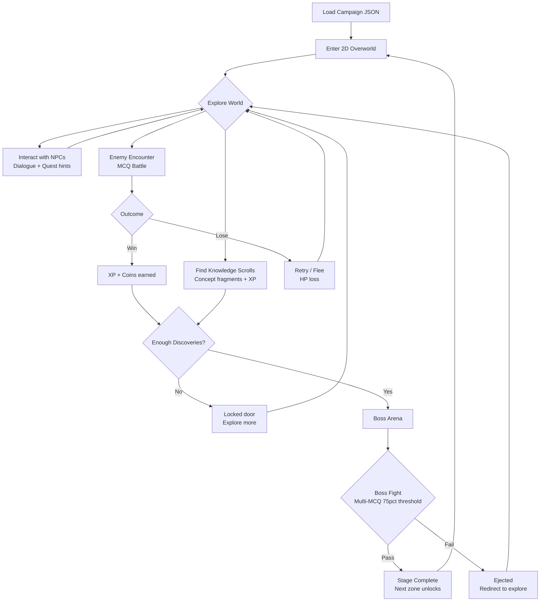
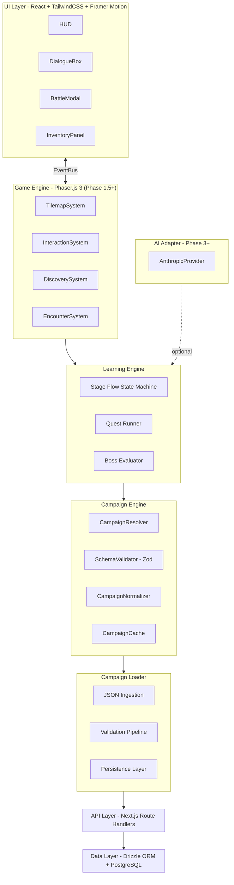
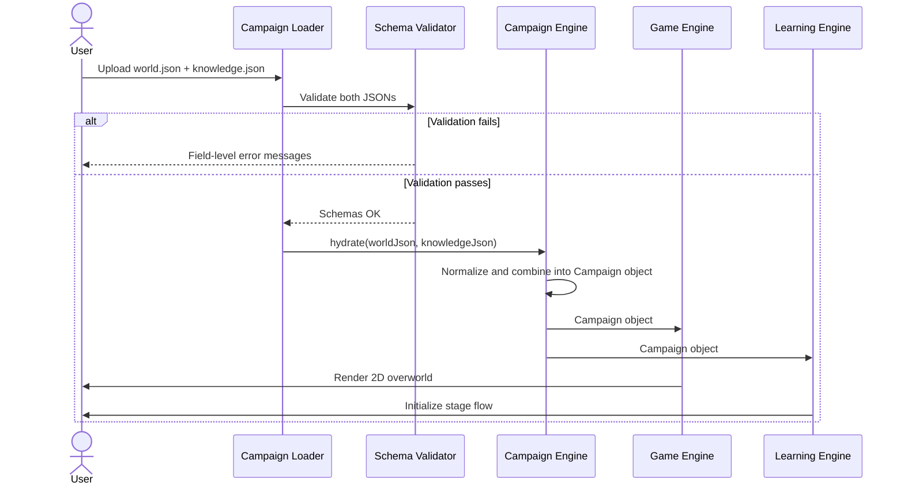
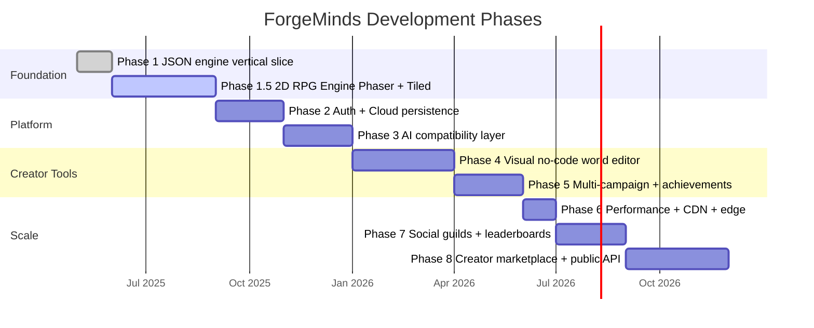
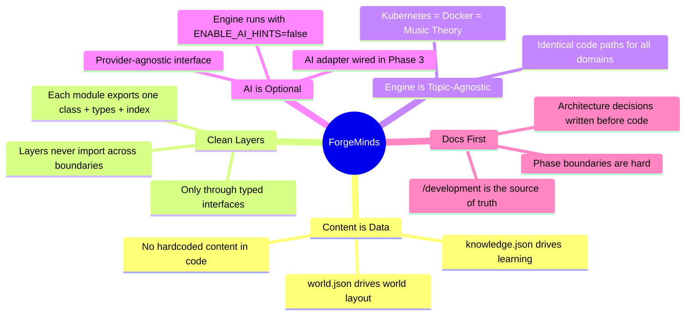

# ForgeMinds

> **A JSON-driven RPG Learning Runtime Engine** — transform any knowledge into an immersive, playable RPG campaign.

---

## What is ForgeMinds?

ForgeMinds is not a quiz app. Not a course platform. Not a Duolingo clone.

It is a **runtime engine** — you supply a `world.json` + `knowledge.json`, and the engine dynamically renders a fully playable 2D RPG learning campaign. Players explore overworlds, fight enemies in MCQ battles, hunt knowledge scrolls, and defeat bosses to master any topic.

The engine knows nothing about the subject being taught. A campaign teaching Kubernetes and a campaign teaching music theory run through **identical code paths**. Content is pure data.

---

## Core Gameplay Loop



---

## Architecture



---

## Data Flow: Loading a Campaign



---

## Tech Stack

| Layer | Technology | Why |
|---|---|---|
| Framework | Next.js 15 App Router + TypeScript | SSR, file routing, co-located APIs |
| Styling | TailwindCSS v4 | Utility-first, zero dead CSS |
| Animation | Framer Motion | Spring physics, layout animations |
| 2D Engine | Phaser.js 3 | Full game engine: tilemap, physics, input, scenes |
| Tilemap | Tiled Map Editor | Visual world design → exports JSON |
| UI State | Zustand v5 | Minimal API, modular slices |
| Server State | TanStack Query v5 | Caching, background refetch, offline |
| Backend | Next.js Route Handlers | Zero extra infra for Phase 1 |
| Database | PostgreSQL 16 + Drizzle ORM | Type-safe schema-as-code |
| Auth | Better Auth | TypeScript-native, self-hosted |
| Validation | Zod | Runtime + compile-time safety |
| AI | Anthropic Claude API | Phase 3+, optional, off by default |
| Testing | Vitest + Playwright | Unit, integration, E2E |

---

## Roadmap



| Phase | Focus | Status |
|---|---|---|
| 1 | JSON engine vertical slice — campaign loader, runtime world generation, core game loop | ✅ Complete |
| 1.5 | 2D RPG Engine — Phaser.js tilemap world, NPC dialogues, monster encounters, boss arenas | 🔲 In Progress |
| 2 | Auth, cloud persistence, campaign library, multi-world | 🔲 Planned |
| 3 | AI compatibility layer — optional hint generation (provider-agnostic, off by default) | 🔲 Planned |
| 4 | Visual no-code world editor — JSON builder UI, drag-and-drop, tilemap designer | 🔲 Planned |
| 5 | Multi-campaign expansion, quest branching, achievement system | 🔲 Planned |
| 6 | Performance optimization — caching, CDN, edge rendering | 🔲 Planned |
| 7 | Social features — guilds, leaderboards, co-quests | 🔲 Planned |
| 8 | Creator marketplace, enterprise training, public API | 🔲 Planned |

---

## Project Structure

```
forgeMinds/
├── development/              ← all planning + architecture docs (source of truth)
│   ├── MASTER_ROADMAP.md
│   ├── architecture.md
│   ├── tech-stack.md
│   ├── game-engine-design.md
│   ├── phases/               ← per-phase implementation plans
│   └── ...
├── src/
│   ├── app/                  ← Next.js App Router pages + API routes
│   ├── engine/
│   │   ├── phaser/           ← Phaser.js game engine (Phase 1.5+)
│   │   ├── learning/         ← stage flow, quest runner, boss evaluation
│   │   ├── content/          ← campaign engine, resolver, normalizer
│   │   ├── loader/           ← JSON ingestion + validation pipeline
│   │   └── ai/               ← AI adapter (Phase 3+)
│   ├── store/                ← Zustand slices (player, progress, game, ui)
│   ├── components/           ← React UI components
│   ├── content/              ← starter template JSON files
│   ├── db/                   ← Drizzle schema + migrations
│   ├── lib/                  ← auth, query client, utils
│   └── types/                ← global shared types
├── public/                   ← assets, sprites, tilesets, fonts
└── tests/                    ← unit / integration / e2e
```

---

## Getting Started

### Prerequisites

- Node.js 20+
- npm or pnpm
- PostgreSQL 16 (or a [Neon](https://neon.tech) serverless Postgres URL)

### Installation

```bash
# 1. Clone the repo
git clone https://github.com/mdnumanraza/ForgeMinds.git
cd ForgeMinds

# 2. Install dependencies
npm install

# 3. Configure environment
cp .env.local.example .env.local
# Edit .env.local with your DATABASE_URL, BETTER_AUTH_SECRET, etc.

# 4. Run database migrations
npm run db:migrate

# 5. Start development server
npm run dev
```

Open [http://localhost:3000](http://localhost:3000).

### Available Scripts

| Command | Description |
|---|---|
| `npm run dev` | Start dev server with Turbopack |
| `npm run build` | Production build |
| `npm run start` | Start production server |
| `npm run test` | Run unit tests (Vitest) |
| `npm run test:e2e` | Run E2E tests (Playwright) |
| `npm run typecheck` | TypeScript type check |
| `npm run lint` | ESLint |
| `npm run validate-content` | Validate all template JSON files |

---

## How to Use ForgeMinds

ForgeMinds renders **any** topic as a playable RPG campaign. All you need is two JSON files.

### 1. Create your `world.json`

Define the overworld map: stages, boss arenas, NPC positions, and visual layout.

```json
{
  "id": "docker-fundamentals",
  "title": "Docker: Containerization Wars",
  "theme": "cyberpunk",
  "stages": [
    {
      "id": "stage-1",
      "title": "The Container Citadel",
      "position": { "x": 200, "y": 300 },
      "nodeIconKey": "container-icon",
      "unlockCondition": null
    }
  ],
  "bossStages": ["stage-5"],
  "npcs": [
    {
      "id": "npc-guide",
      "name": "The Docker Sage",
      "dialogue": ["Every container is an isolated world...", "Learn to wield images and you control the realm."]
    }
  ]
}
```

### 2. Create your `knowledge.json`

Define the learning content: quests, MCQ questions, XP rewards, and boss battles.

```json
{
  "campaignId": "docker-fundamentals",
  "stages": [
    {
      "id": "stage-1",
      "quests": [
        {
          "id": "q1",
          "concept": "What is a Docker container?",
          "xpReward": 50,
          "questions": [
            {
              "text": "A Docker container is...",
              "options": ["A virtual machine", "An isolated process environment", "A cloud server", "A database"],
              "correctIndex": 1,
              "explanation": "Containers share the host OS kernel but isolate processes, making them lighter than VMs."
            }
          ]
        }
      ],
      "bossThreshold": 0.75
    }
  ]
}
```

### 3. Load it in the app

1. Open ForgeMinds in your browser
2. Click **Load Campaign**
3. Paste or upload your `world.json` and `knowledge.json`
4. The engine validates both files and launches your campaign instantly

> You can generate both JSON files using ChatGPT, Claude, or any AI tool — just give it the schema and topic. The `src/content/` directory has complete examples to use as templates.

---

## Architecture Principles



---

## Contributing

### Setup Git to Contribute

```bash
# 1. Clone the repo using your PAT token (required for push access)
git clone https://<your-pat-token>@github.com/mdnumanraza/ForgeMinds.git
cd ForgeMinds

# 2. Set your identity (one-time per machine)
git config user.name "your-github-username"
git config user.email "your-personal-email@example.com"

# 3. Make your changes, then stage and commit
git add .
git commit -m "feat: describe what you changed"

# 4. Push to main
git push origin main
```

> **Generating a PAT token:** GitHub → Settings → Developer Settings → Personal Access Tokens → Tokens (classic) → Generate new token. Select `repo` scope. Copy the token and use it in the clone URL above.

### Development Rules

1. **Docs first** — update `/development` before touching code
2. **No scope creep** — stay within the current phase deliverables
3. **Clean boundaries** — no cross-layer imports
4. **Tests required** — every engine module needs unit tests
5. **Type-safe** — no `any`, no implicit types
6. **Content is data** — no hardcoded world/quest data in TypeScript files

---

## Design Goals

- **Game-first** — feels like a game, not a learning tool
- **Immersive** — rich 2D worlds, NPC dialogue, sound effects, visual progression
- **Rewarding** — XP, leveling, unlocks, boss victories trigger real satisfaction
- **Content-agnostic** — the engine teaches whatever JSON you give it
- **Creator-friendly** — anyone with a text editor (or ChatGPT) can build a campaign

---

<div align="center">
  <sub>Built with focus. Designed to make learning addictive.</sub>
</div>
